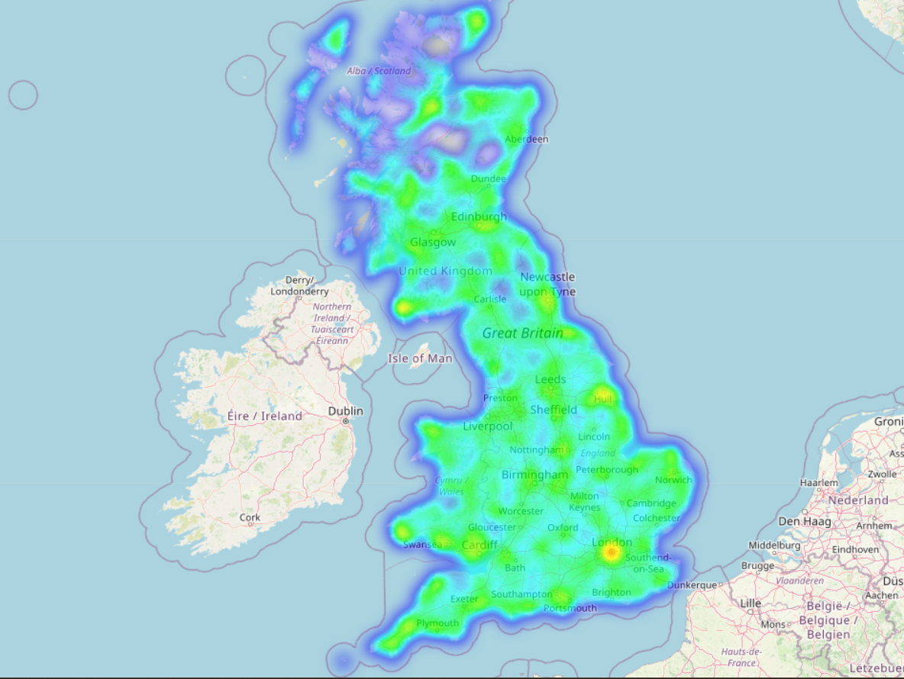

# Road Accident Data Visualization Project

## Project Description

This project provides a web-based interface to visualize and analyze road accident data. The application is built using Flask and leverages interactive visualizations to help users explore accident trends, casualty data, and other relevant insights. The data is stored in a MySQL database and processed with Python libraries such as Pandas and Plotly for visualization.

This project is ideal for policymakers, traffic authorities, and researchers to make data-driven decisions for improving road safety and reducing accidents.

---

## Key Features

### 1. Accident Heatmap
- **Purpose**: Displays an interactive heatmap of accident locations for the latest one-year period (2014–2015).
- **Details**:
  - Uses accident latitude and longitude for plotting.
  - Heat intensity represents accident severity (higher intensity = more severe).
- **Use Case**: Identify geographic hotspots of accidents to prioritize safety measures.
- **Image**:
  

---

### 2. Casualties Chart
- **Purpose**: Visualize the total number of casualties categorized by accident severity.
- **X-Axis**: Accident severity categories:
  - `Fatal`: Accidents resulting in death.
  - `Serious`: Accidents causing severe injuries.
  - `Slight`: Accidents causing minor injuries.
- **Y-Axis**: Total number of casualties for each severity level.
- **Details**:
  - Highlights the distribution of casualties based on severity.
  - Enables prioritization of resources for the most critical accident categories.
- **Image**:
  

---

### 3. Accidents by Weather
- **Purpose**: Show the total number of accidents categorized by weather conditions.
- **X-Axis**: Weather condition codes:
  - `1`: Fine without high winds.
  - `2`: Raining without high winds.
  - `3`: Snowing without high winds.
  - `4`: Fine with high winds.
  - `5`: Raining with high winds.
  - `6`: Snowing with high winds.
  - `7`: Fog or mist.
  - `8`: Other.
  - `9`: Unknown.
- **Y-Axis**: Total number of accidents for each weather condition.
- **Details**:
  - Demonstrates the impact of weather conditions on accidents.
  - Provides actionable insights for weather-related traffic safety measures.
- **Image**:
  

---

### 4. Casualties by Sex
- **Purpose**: Represent the gender distribution of casualties in a pie chart.
- **Legend**:
  - `Male`: Male casualties.
  - `Female`: Female casualties.
  - `Unknown`: Gender not recorded.
- **Details**:
  - Provides demographic insights into casualty data.
  - Helps design gender-specific awareness campaigns for road safety.
- **Image**:
  

---

### 5. Vehicle Types
- **Purpose**: Display the count of vehicles involved in accidents categorized by type.
- **X-Axis**: Vehicle types:
  - `1`: Pedal Cycle.
  - `2`: Motorcycle 50cc and under.
  - `3`: Motorcycle 125cc and under.
  - `4`: Motorcycle over 125cc.
  - `5`: Motorcycle over 500cc.
  - `8`: Taxi/Private hire car.
  - `9`: Car.
  - `10`: Minibus.
  - `11`: Bus or coach (17 or more passengers).
  - `16`: Agricultural vehicle.
  - `17`: Tram.
  - `18`: Van/Goods vehicle (3.5 tonnes mgw and under).
  - `19`: Goods vehicle (over 3.5 tonnes).
  - `20`: Mobility scooter.
  - `21`: Electric scooter.
  - `22`: Other vehicle.
  - `23`: Ridden horse.
  - `97`: Motor vehicle (type unknown).
  - `98`: Non-motor vehicle (type unknown).
- **Y-Axis**: Number of vehicles involved in accidents for each type.
- **Details**:
  - Identifies high-risk vehicle categories for targeted interventions.
  - Provides insights into traffic compositions and accident trends.
- **Image**:
  

---

### 6. Accident Severity by Month
- **Purpose**: Visualize accident severity trends across months in a grouped bar chart.
- **X-Axis**: Months of the year (January to December).
- **Y-Axis**: Number of accidents.
- **Legend**: Accident severity levels:
  - `Fatal`: Accidents causing death.
  - `Serious`: Accidents causing severe injuries.
  - `Slight`: Accidents causing minor injuries.
- **Details**:
  - Identifies seasonal or monthly patterns in accident severity.
  - Helps allocate resources based on temporal trends.
- **Image**:
  

---

## Relational Schema

### Database Tables

#### 1. Accidents Table
- **Columns**:
  - `Accident_ID`: Unique identifier for each accident.
  - `Latitude`: Latitude of the accident location.
  - `Longitude`: Longitude of the accident location.
  - `Date`: Date of the accident.
  - `Weather_Conditions`: Weather condition code (see legend in "Accidents by Weather").
  - `Light_Conditions`: Lighting conditions at the time of the accident.
  - `Accident_Severity`: Severity of the accident:
    - `1`: Fatal.
    - `2`: Serious.
    - `3`: Slight.
  - `Number_of_Casualties`: Total number of casualties in the accident.

#### 2. Vehicles Table
- **Columns**:
  - `Accident_ID`: Links to the `Accidents` table.
  - `Vehicle_Type`: Type of vehicle involved in the accident.
  - `Vehicle_Manoeuvre`: Manoeuvre performed during the accident.
  - `Skidding_and_Overturning`: Indicates skidding or overturning.

#### 3. Casualties Table
- **Columns**:
  - `Accident_ID`: Links to the `Accidents` table.
  - `Casualty_Severity`: Severity of injury to the casualty.
  - `Sex_of_Casualty`: Gender of the casualty.

---

## Dataset Description

### Columns Overview

#### **Accidents Dataset**
- **Accident_Index**: Unique identifier for each accident record.
- **Longitude**: Longitude coordinates of the accident location.
- **Latitude**: Latitude coordinates of the accident location.
- **Accident_Severity**: Code representing accident severity (1: Fatal, 2: Serious, 3: Slight).
- **Date**: Date when the accident occurred.
- **Weather_Conditions**: Numeric code indicating weather conditions (e.g., 1: Fine, 2: Raining, etc.).
- **Road_Surface_Conditions**: Surface conditions during the accident (e.g., dry, wet).
- **Light_Conditions**: Lighting conditions at the time of the accident (e.g., daylight, darkness).
- **Number_of_Casualties**: Total number of casualties reported for the accident.
- **Number_of_Vehicles**: Total number of vehicles involved in the accident.

#### **Vehicles Dataset**
- **Vehicle_Type**: Type of vehicle involved in the accident (see Vehicle Types plot legend).
- **Vehicle_Manoeuvre**: Description of vehicle maneuver at the time of the accident.
- **Skidding_and_Overturning**: Indicates whether the vehicle skidded or overturned.

#### **Casualties Dataset**
- **Casualty_Severity**: Code indicating the severity of casualty injuries (1: Fatal, 2: Serious, 3: Slight).
- **Sex_of_Casualty**: Gender of the casualty (1: Male, 2: Female, -1: Unknown).
- **Age_of_Casualty**: Age of the casualty at the time of the accident.
- **Casualty_Class**: Classification of the casualty (e.g., pedestrian, driver, passenger).

---

## Installation Instructions

1. **Clone the Repository**:
   ```bash
   git clone https://github.com/your-repo.git
   cd your-repo
   ```

2. **Install Dependencies**:
   ```bash
   pip install -r requirements.txt
   ```

3. **Set Up the Database**:
   - Update `config.py` with your database credentials:
     ```python
     DB_USER = 'your_username'
     DB_PASSWORD = 'your_password'
     DB_HOST = 'your_host'
     DB_NAME = 'your_database_name'
     MAP_DEFAULT_LOCATION = [54.5260, -2.6189]
     MAP_DEFAULT_ZOOM_START = 6
     ```

4. **Run the Application**:
   ```bash
   python app.py
   ```

5. **Access the Application**:
   - Open your browser and navigate to `http://127.0.0.1:5000`.

---
